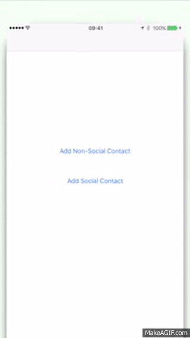
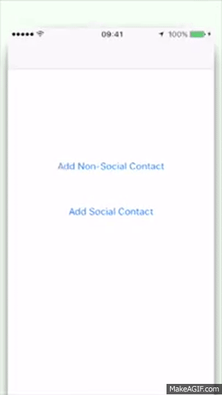

# Contacts Integration

This project is a POC that will allow you to Add a New Contact to your Contacts.  I created it to demonstrate an issue I'm running into with the Contacts API.

* When I Create a contact (with or without socialProfiles) on the Simulator, it works fine.
* When I Create a contact (with or without socialProfiles) on my iPhone 5S (iOS 9.3), it also works just fine.
* When I Create a contact with socialProfiles on my iPhone 6SPlus (iOS 9.3), the Contact fails to be created.

The code block that's responsible for this is:

```swift
// Excerpt from ContactProvider, saveContact Method

let saveRequest = CNSaveRequest()
saveRequest.addContact(contact, toContainerWithIdentifier: nil)
try contactStore.executeSaveRequest(saveRequest)
print("Saved \(contact) to the Address Book")

```

I have 2 videos that I created using QuickTime to record video from my devices, and then iMovie to create an "App Preview" to master the following videos:

## Failure

## Success

